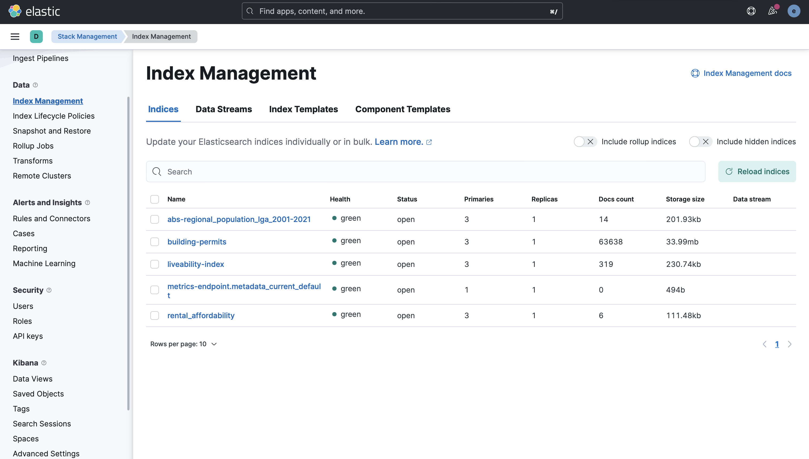
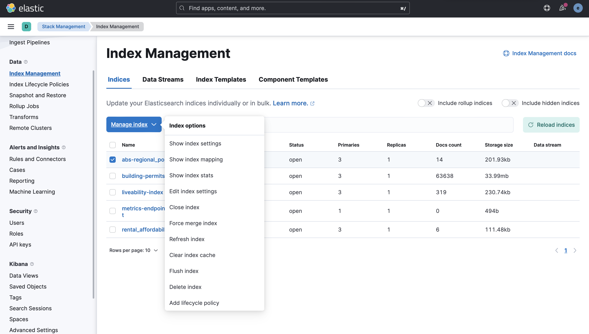
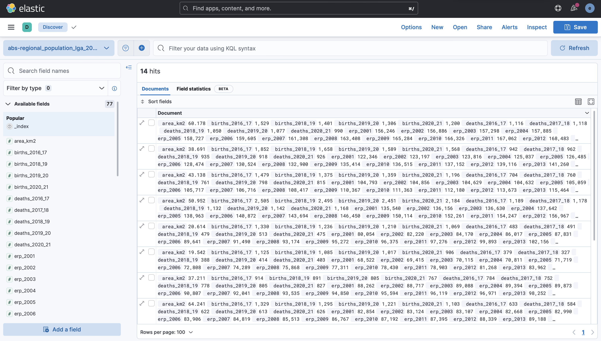
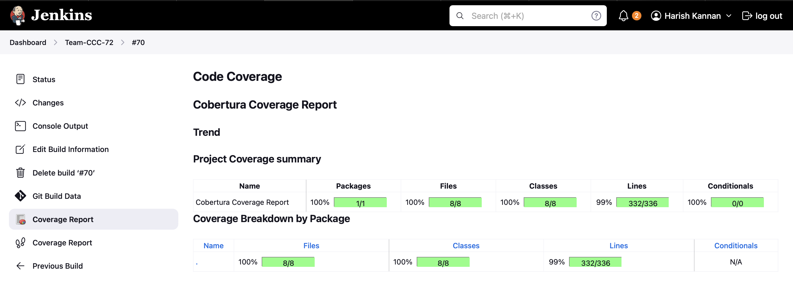
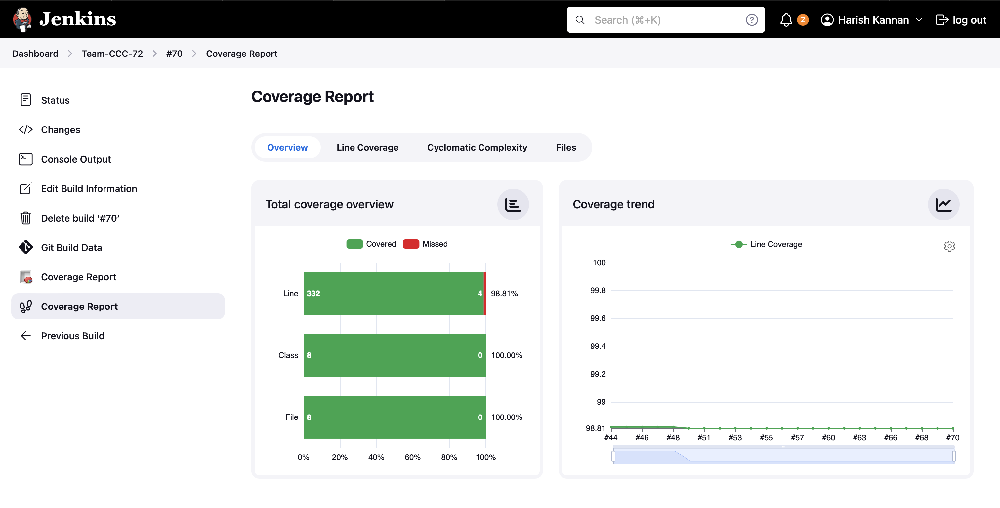
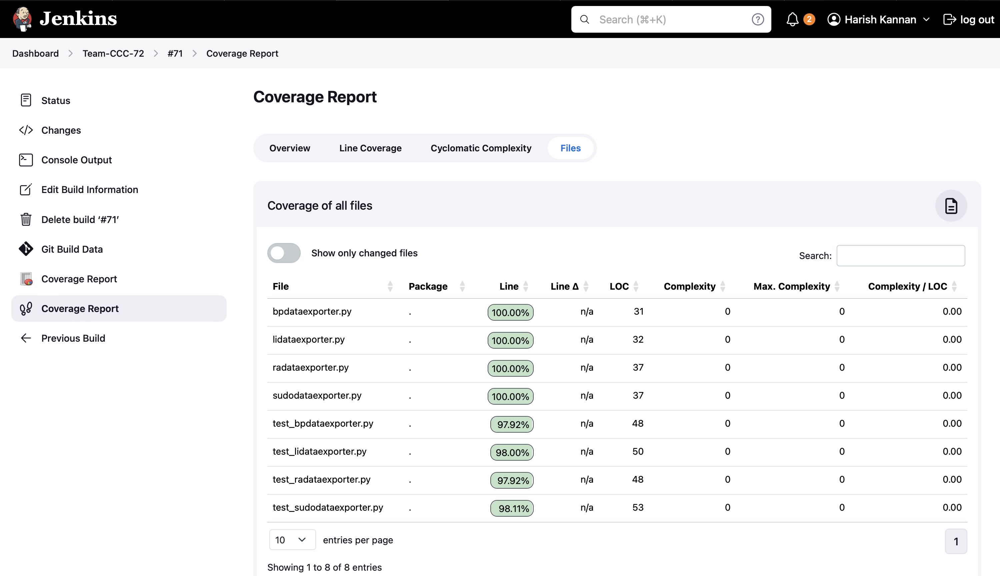

# COMP90024 Assignment 2

The below images document this project's databse structure and setup. Refer to the report for much more detailed information regarding the databse design choices and setup.

## Index Creation

Initially, indexes needed to be created in ElasticSearch for data to be stored. The below image shows a HTTP PUT request to create the index for a particular dataset.

Note that deletion of indexes are possible in the same way, but via a DELETE HTTP request. See below image for deletion example.

## Kibana Index Views

Kibana index management allows us to view all created indexes.

Via Kibana, it is possible to select and perform operations on an individual index for activities such as deleting and refreshing the index.

It is also possible to view the index with the data via Kibana. By creating a filter under the discover section, data can be directly visualised without having to be retreived locally.

## Jenkins Code Coverage

Below are images which show the code coverage via the Jenkins pipeline with the test scripts found in the [test directory](../test/)

