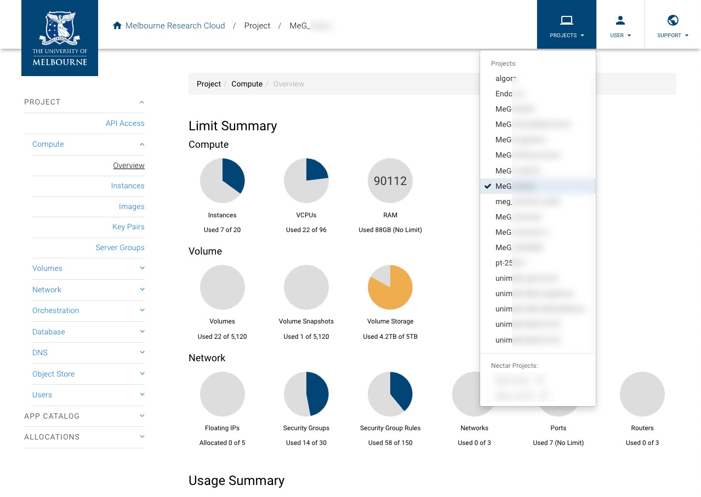
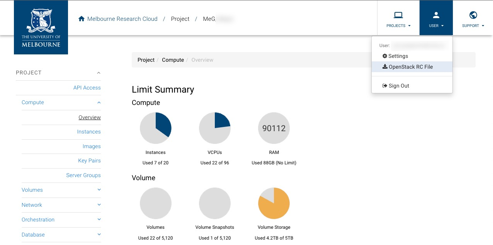
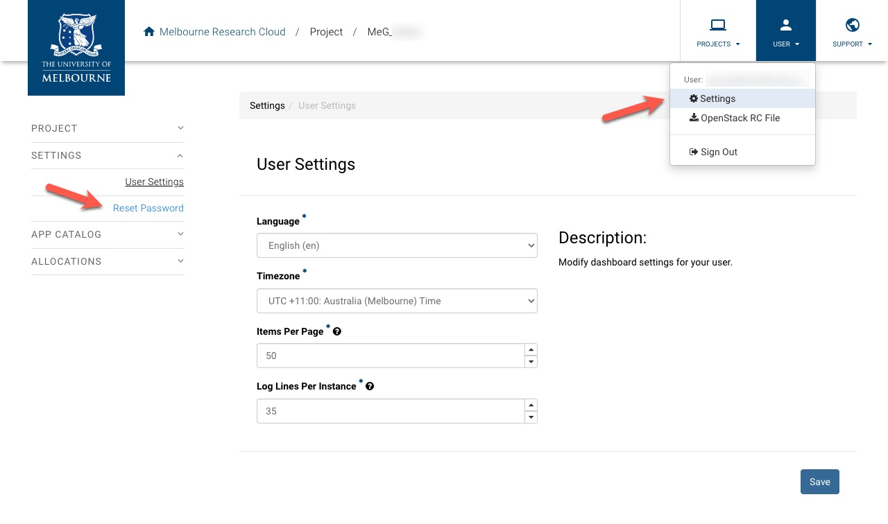
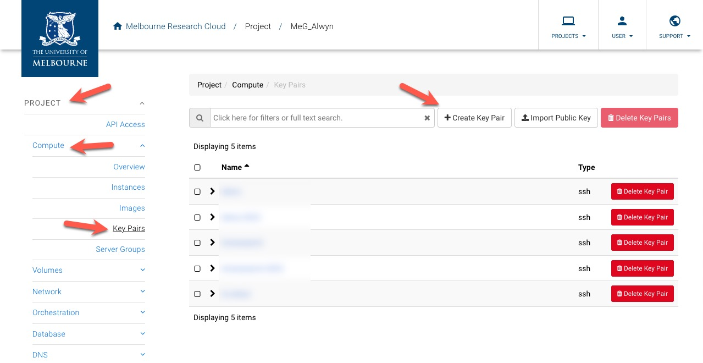
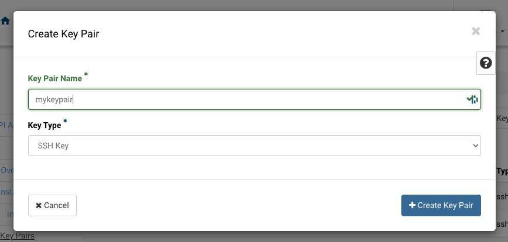
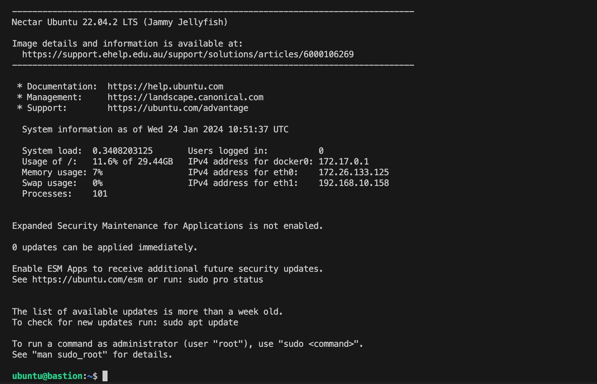

# ElasticSearch

## Pre-requirements

- OpenStack clients 5.4.x ([Installation instructions](https://docs.openstack.org/newton/user-guide/common/cli-install-openstack-command-line-clients.html)).
  > Note: Please ensure the following Openstack clients are installed: `python-cinderclient`, `python-keystoneclient`, `python-magnumclient`, `python-neutronclient`, `python-novaclient`, `python-octaviaclient`. See: [Install the OpenStack client](https://docs.openstack.org/newton/user-guide/common/cli-install-openstack-command-line-clients.html).
- JQ 1.6.x ([Installation instructions](https://jqlang.github.io/jq/download/)).
- Kubectl 1.26.x ([Installation instructions](https://kubernetes.io/docs/tasks/tools/)).
- Helm 3.6.x ([Installation instructions](https://helm.sh/docs/intro/install/)).
- MRC project with enough resources to create a Kubernetes cluster.
- Connect to [Campus network](https://studentit.unimelb.edu.au/wifi-vpn#uniwireless) if on-campus or [UniMelb Student VPN](https://studentit.unimelb.edu.au/wifi-vpn#vpn) if off-campus

## Client Configuration

1. Log in to the [MRC Dashboard](https://dashboard.cloud.unimelb.edu.au/auth/login/?next=/) with your University of Melbourne credentials and select the project you want to use.
   

2. Download the OpenStack RC file from the `User` menu.
   

3. Obtain the Openstack password from `User` -> `Settings` menu, click on `Reset Password` on the left and save the password in a safe place.
   

4. Source the OpenStack RC file downloaded in step 2 in your terminal and enter the password obtained in step 3 when prompted.

> Note: Password will not be displayed on the screen when typed.

```shell
source ./<your project name>-openrc.sh
```

5. Click `Project` -> `Compute` -> `Key Pairs` -> `Create Key Pair` and create a new key pair named `mykeypair` (replace `mykeypair` with the name you prefer). Keep the private key file downloaded (e.g. `mykeypair.pem`) in a safe place.
   
   

## Cluster Template Creation

- Run the following command to create a cluster template named `kubernetes-melbourne-qh2-uom-nofloat-v1.26.8`

> Note: Replace the `mykeypair` and `uom.mse.2c9g` with the key pair you created in the previous step, and the flavor you want to use for the master and worker nodes respectively.

```shell
openstack coe cluster template create \
  --keypair mykeypair \
  --labels "container_infra_prefix=registry.rc.nectar.org.au/nectarmagnum/; \
master_lb_floating_ip_enabled=false; \
cinder_csi_enabled=true; \
docker_volume_type=standard; \
ingress_controller=octavia; \
container_runtime=containerd; \
containerd_version=1.6.20; \
containerd_tarball_sha256=1d86b534c7bba51b78a7eeb1b67dd2ac6c0edeb01c034cc5f590d5ccd824b416; \
kube_tag=v1.26.8; \
flannel_tag=v0.21.5; \
cloud_provider_tag=v1.26.3; \
cinder_csi_plugin_tag=v1.26.3; \
k8s_keystone_auth_tag=v1.26.3; \
octavia_ingress_controller_tag=v1.26.3; \
coredns_tag=1.10.1; \
csi_snapshotter_tag=v6.2.1; \
csi_attacher_tag=v4.2.0; \
csi_resizer_tag=v1.7.0; \
csi_provisioner_tag=v3.4.1; \
csi_node_driver_registrar_tag=v2.8.0; \
availability_zone=melbourne-qh2-uom; \
fixed_subnet_cidr=192.168.10.0/24" \
  --floating-ip-disabled \
  --master-lb-enabled \
  --master-flavor=$(openstack flavor list | grep 'uom.mse.2c9g' | awk '{print $2}') \
  --flavor=$(openstack flavor list | grep 'uom.mse.2c9g' | awk '{print $2}') \
  --server-type='vm'\
  --external-network='melbourne' \
  --image='fedora-coreos-37' \
  --volume-driver='cinder' \
  --docker-storage-driver='overlay2' \
  --network-driver='flannel' \
  --coe='kubernetes' \
  --dns-nameserver='128.250.201.5,128.250.66.5' \
  kubernetes-melbourne-qh2-uom-nofloat-v1.26.8
```

- Verify that template has been created successfully.

```shell
openstack coe cluster template show $(openstack coe cluster template list | grep "kubernetes-melbourne-qh2-uom-nofloat-v1.26.8" | awk '{print $2}') --max-width 132
```

## Kubernetes Cluster Provisioning

- Create a Kubernetes cluster named "elastic" with the newly created template (1 master node and 3 worker nodes).

```shell
openstack coe cluster create\
  --cluster-template "kubernetes-melbourne-qh2-uom-nofloat-v1.26.8" \
  --node-count 3 \
  --master-count 1 \
  elastic
```

- Check whether the cluster has been created healthy (it may take more than 15 minutes).

```shell
openstack coe cluster show elastic --fit-width
```

(`health_status` should be 'HEALTHY' and `coe_version` should be `1.26.8`);

- Create a security group named 'elastic-ssh' that allows SSH access from the University of Melbourne network.

```shell
openstack security group create elastic-ssh
openstack security group rule create --proto tcp --dst-port 22 --remote-ip 0.0.0.0/0 elastic-ssh
```

- Create a network port named 'elastic-bastion'.

```shell
openstack port create --network elastic elastic-bastion
```

- Create a VM named "bastion" with the following features (the VM can be created using the MRC Dashboard).
  - Flavor: `uom.mse.1c4g`;
  - Image: `NeCTAR Ubuntu 22.04 LTS (Jammy) amd64 (with Docker)`;
  - Networks: `qh2-uom-internal` and `elatic` (the Kubernetes cluster network);
  - Security group: `default` and `ssh`.

```shell
openstack server create \
  --flavor uom.mse.1c4g \
  --availability-zone melbourne-qh2-uom \
  --image $(openstack image list --name "NeCTAR Ubuntu 22.04 LTS (Jammy) amd64 (with Docker)" -c ID -f value) \
  --nic net-id=$(openstack network show qh2-uom-internal -f value -c id) \
  --nic port-id=$(openstack port show elastic-bastion -f value -c id) \
  --security-group "elastic-ssh" \
  --key-name mykeypair \
  bastion
```

## Accessing the Kubernetes Cluster

- Once the VM has been created successfully, open an SSH tunnel that allows the connection of your computer to the Kubernetes cluster. Please replace the `<path-to-private-key>` with the path to the private key file downloaded in the previous step.

```shell
chmod 600 <path-to-private-key> (e.g. ~/Downloads/mykeypair.pem)

ssh -i <path-to-private-key> (e.g. ~/Downloads/mykeypair.pem) -L 6443:$(openstack coe cluster show elastic -f json | jq -r '.master_addresses[]'):6443 ubuntu@$(openstack server show bastion -c addresses -f json | jq -r '.addresses["qh2-uom-internal"][]')
```

> Note: The SSH command may take up to 1 minute to complete. And you will see a shell prompt. Please do not close the terminal window once the command has been executed.



- Create the Kubernetes configuration file to access the cluster. This command will create a file named `config` in the current directory.

```shell
openstack coe cluster config elastic
```

- Modify the `config` file by changing the IP address os the server to `127.0.0.1` (as in `server: https://127.0.0.1:6443`)

```shell
awk '
    /^    server:/ { sub(/https:\/\/[^:]+/, "https://127.0.0.1") }
    { print }
' config > temp && mv temp config
```

- Move the config file to `~/.kube/config`.

> Note: If you already have a `~/.kube/config` file, please back it up before executing the following command.

```shell
mv config ~/.kube/config
chmod 600 ~/.kube/config
```

- Check the cluster nodes:

```shell
kubectl get nodes
```

This command should return one master node and the required number of worker nodes.

```shell
NAME                            STATUS   ROLES    AGE     VERSION
elastic-4spknhuyv5bf-master-0   Ready    master   6m16s   v1.26.8
elastic-4spknhuyv5bf-node-0     Ready    <none>   3m27s   v1.26.8
elastic-4spknhuyv5bf-node-1     Ready    <none>   3m9s    v1.26.8
elastic-4spknhuyv5bf-node-2     Ready    <none>   3m31s   v1.26.8
```

> Note: After creating the cluster, check the overlay network component is running correctly:

```shell
kubectl get pod -l app=flannel -n kube-system
```

This command should return a number of pods named `flannel-xxxxx` with status `Running`.

```shell
NAME                    READY   STATUS    RESTARTS   AGE
kube-flannel-ds-9pvdl   1/1     Running   0          31h
kube-flannel-ds-gzvfk   1/1     Running   0          31h
kube-flannel-ds-nx6mg   1/1     Running   0          31h
kube-flannel-ds-sx8dp   1/1     Running   0          31h
```

If any of the pods is not in running state, to drop and recreate the pod.

```shell
kubectl delete pod -l app=flannel -n kube-system
```

## ElasticSearch Storage Class creation

To retain the disk volumes after the cluster deletion, a storage class has to be created that set the reclaim policy to "retain".

```shell
kubectl apply -f ./storage-class.yaml
```

## ElasticSearch cluster deployment

Set the ElasticSearch version to be used `export ES_VERSION="8.5.1"`, then install ElasticSearch:

```shell
kubectl create namespace elastic
helm repo add elastic https://helm.elastic.co
helm repo update
export ES_VERSION="8.5.1"
helm upgrade --install \
  --version=${ES_VERSION} \
  --namespace elastic \
  --set replicas=2 \
  --set secret.password="elastic"\
  elasticsearch elastic/elasticsearch
```

NOTES:

- By default each ElasticSearch node has 30GB of storage;
- The number of nodes is set by the `replicas` parameter. not to be confused with the "shard replicas" (copies of a shard);
- The number of replicas (nodes) that can be used in the cluster is limited by the number of nodes in the cluster and by the Kibana deployment that needs a node for itself.

Check all ElasticSearch pods are running before proceeding:

```shell
kubectl get pods -l release=elasticsearch -n elastic --watch
```

This command will watch the pods' status. You can use `Ctrl + C` to stop watching once you see the pods are in `Running` state.

```shell
NAME                     READY   STATUS     RESTARTS   AGE
elasticsearch-master-0   0/1     Init:0/1   0          20s
elasticsearch-master-1   0/1     Init:0/1   0          20s
elasticsearch-master-0   0/1     Init:0/1   0          59s
elasticsearch-master-1   0/1     Init:0/1   0          59s
elasticsearch-master-1   0/1     PodInitializing   0          60s
elasticsearch-master-0   0/1     PodInitializing   0          61s
elasticsearch-master-1   0/1     Running           0          61s
elasticsearch-master-0   0/1     Running           0          62s
```

## Kibana deployment

```shell
helm upgrade --install \
  --version=${ES_VERSION} \
  --namespace elastic \
  -f ./kibana-values.yaml \
  kibana elastic/kibana
```

Check all ElasticSearch pods are running before proceeding:

```shell
kubectl get pods -l release=kibana -n elastic --watch
```

This command will watch the pods' status. You can use `Ctrl + C` to stop watching once you see the pods are in `Running` state.

Check all services are created before proceeding.

```shell
kubectl get service -n elastic
```

This command will list all service in the Kubernetes cluster.

```shell
NAME                            TYPE        CLUSTER-IP     EXTERNAL-IP   PORT(S)             AGE
elasticsearch-master            ClusterIP   10.254.75.27   <none>        9200/TCP,9300/TCP   17h
elasticsearch-master-headless   ClusterIP   None           <none>        9200/TCP,9300/TCP   17h
kibana-kibana                   ClusterIP   10.254.50.97   <none>        5601/TCP            17h
```

## Accessing the ElasticSearch API and the Kibana User Interface

To access services on the cluster, one has to use the `port-forward` command of `kubectl` in a new terminal window.

```shell
kubectl port-forward service/elasticsearch-master -n elastic 9200:9200
```

> Note: This command will start the port forwarding so please keep this terminal open and do not close it.

```shell
kubectl port-forward service/elasticsearch-master -n elastic 9200:9200
```

To access the Kibana user interface, one has to use the `port-forward` command of `kubectl` (another terminal window):

```shell
kubectl port-forward service/kibana-kibana -n elastic 5601:5601
```

> Note: This command will start the port forwarding so please keep this terminal open and do not close it.
> Note: The port forwarding can be stopped by pressing `Ctrl + C` and closing the terminal window. The port forwarding is only active when the terminal window is open. Once it is stopped, you need to re-run the command to start the port forwarding again.

Test the ElasticSearch API:

```shell
curl -k 'https://127.0.0.1:9200' --user 'elastic:elastic' | jq '.'
curl -k 'https://127.0.0.1:9200/_cluster/health' --user 'elastic:elastic' | jq '.'
```

Test the Kibana user interface by pointing the browser to: `http://127.0.0.1:5601/` (the default credentials are `elastic:elastic`).

## Create an ElasticSearch Index

```shell
curl -XPUT -k 'https://127.0.0.1:9200/students'\
   --header 'Content-Type: application/json'\
   --data '{
    "settings": {
        "index": {
            "number_of_shards": 3,
            "number_of_replicas": 1
        }
    },
    "mappings": {
        "properties": {
            "id": {
                "type": "text"
            },
            "name": {
                "type": "text"
            },
            "course": {
                "type": "text"
            },
            "mark": {
                "type": "short"
            }
        }
    }
}'\
   --user 'elastic:elastic' | jq '.'
```

The index should now be shown in the Kibana dashboard.

Let's try to add a document to the newly created index:

```shell
curl -XPUT -k "https://127.0.0.1:9200/students/_doc/1234567"\
  --header 'Content-Type: application/json'\
  --data '{
        "name": "John Smith",
        "course": "Cloud Computing",
        "mark": 80
  }'\
  --user 'elastic:elastic' | jq '.'

curl -XPUT -k "https://127.0.0.1:9200/students/_doc/0123456"\
  --header 'Content-Type: application/json'\
  --data '{
        "name": "Jane Doe",
        "course": "Cloud Computing",
        "mark": 90
    }'\
  --user 'elastic:elastic' | jq '.'
```

You can now do a full text search by just typing "John" in the search box and pressing enter.

Let's do a search via the API:

```shell
curl -XGET -k "https://127.0.0.1:9200/students/_search"\
  --header 'Content-Type: application/json'\
  --data '{
      "query": {
        "match": {
          "course": "cloud*"
        }
      }
    }'\
  --user 'elastic:elastic' | jq '.'
```

(The use of a body in a GET request is not ReSTful, and hardly supported by HTTP... but it is allowed by ElasticSearch.)

## Create a data view from Kibana

Go to Kibana, create a data view named "students" with pattern "student\*", and check that the documents have been
added to the index by going to "Analysis / Discover".

Now Kibana can be used to test search queries or to have a look at data.

## ElasticSearch parent-child join

To avoid repeating data about the course, it is possible to create a parent-child relationship between the student and the course.
with some limitations.

Let's first delete the `students` index:

```shell
curl -XDELETE -k 'https://127.0.0.1:9200/students'\
   --user 'elastic:elastic' | jq '.'
```

Then let's re-create the database with a mapping that defines the parent-child relationship:

```shell
curl -XPUT -k 'https://127.0.0.1:9200/students' \
  --header 'Content-Type: application/json' \
  --data '{
    "settings": {
        "index": {
            "number_of_shards": 3,
            "number_of_replicas": 1
        }
    },
    "mappings": {
        "properties": {
            "uomid": {
                "type": "text"
            },
            "name": {
                "type": "text"
            },
            "mark": {
                "type": "short"
            },
            "coursedescription": {
                "type": "text"
            },
            "relation_type": {
                "type": "join",
                "relations": {
                    "parent": "child"
                }
            }
        }
    }
}' \
  --user 'elastic:elastic' | jq '.'
```

Let's insert some data about courses and students that use the parent-child relationship:

```shell
curl -XPUT -k "https://127.0.0.1:9200/students/_doc/1?routing=comp90024"\
  --header 'Content-Type: application/json'\
  --data '{
        "name": "COMP90024",
        "coursedescription": "Cloud Computing",
        "relation_type": {
          "name": "parent"
        }
    }'\
  --user 'elastic:elastic' | jq '.'

curl -XPUT -k "https://127.0.0.1:9200/students/_doc/2?routing=comp90024"\
  --header 'Content-Type: application/json'\
  --data '{
        "name": "John Smith",
        "uomid": "1234567",
        "mark": 80,
        "relation_type": {
          "name": "child",
          "parent": 1
        }
  }'\
  --user 'elastic:elastic' | jq '.'

curl -XPUT -k "https://127.0.0.1:9200/students/_doc/3?routing=comp90024"\
  --header 'Content-Type: application/json'\
  --data '{
        "name": "Jane Doe",
        "uomid": "0123456",
        "mark": 90,
        "relation_type": {
          "name": "child",
          "parent": 1
        }
      }'\
  --user 'elastic:elastic' | jq '.'
```

Example of a query that returns all students of a give course that have a mark greater than 80:

```shell
curl -XGET -k "https://127.0.0.1:9200/students/_search"\
  --header 'Content-Type: application/json'\
  --data '{
    "query": {
        "bool": {
            "must": [
                {
                    "range": {
                        "mark": {
                            "gt": 80
                        }
                    }
                },
                {
                    "has_parent": {
                        "parent_type": "parent",
                        "query": {
                            "match": {
                                "name": "comp90024"
                            }
                        }
                    }
                }
            ]
        }
    }
}'\
  --user 'elastic:elastic' | jq '.'
```

## Use of ElasticSearch as a vector DBMS

TODO.

## Removal

### ElasticSearch Cluster Removal

```shell
helm uninstall kibana -n elastic
helm uninstall elasticsearch -n elastic
```

### Kubernetes Cluster Removal

```shell
openstack coe cluster delete elastic
```
